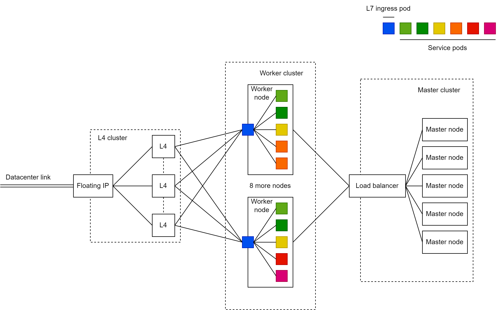
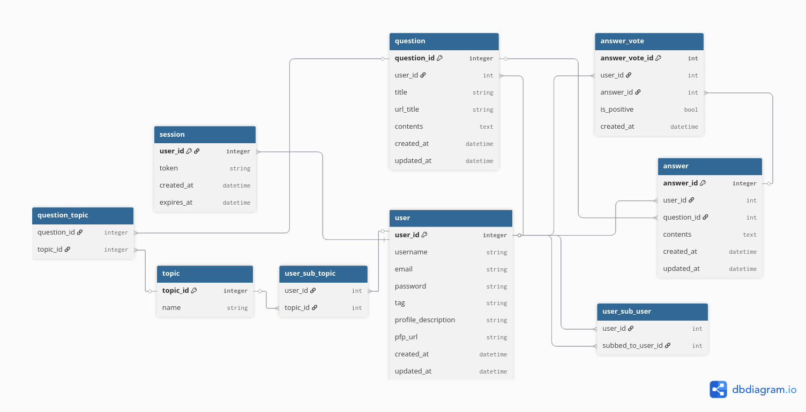
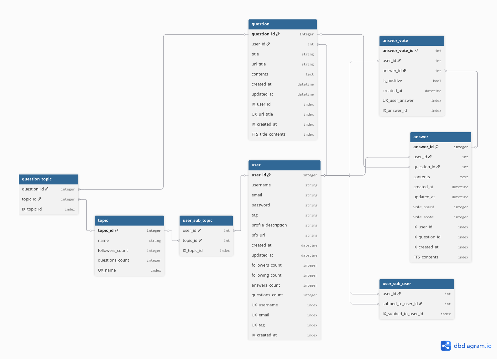
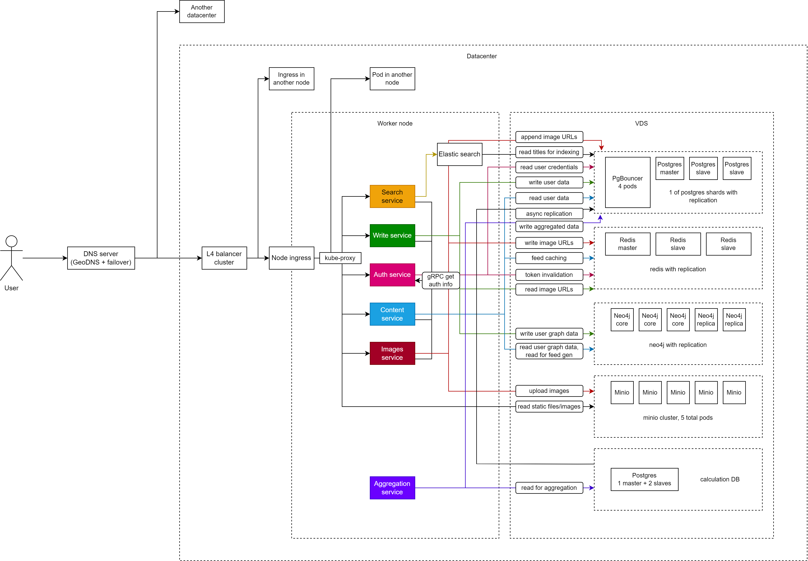

# Курсовая работа по курсу "Проектирование высоконагруженных систем"

Студент: Волощук А. Д.
Группа: WEB-41 (осень 2025)

# Quora

## 1. Тема и целевая аудитория

**Тип сервиса**: вопросно-ответный форум, сфокусированный на формировании качественной базы знаний

**Местоположение целевой аудитории**: мир

**MAU**: 400M ([1](https://www.demandsage.com/quora-statistics/))
**DAU**: 27M ([1](https://www.demandsage.com/quora-statistics/))

**Основные регионы по числу посещений** ([1](https://www.demandsage.com/quora-statistics/)):

| Страна/Регион | Число пользователей |
|---------------|---------------------|
| США | 148M |
| Индия | 100M |
| Европа | 78M |
| Юго-Восточная Азия | 24M |
| Великобритания | 22.5M |
| Средний Восток и Северная Африка | 15M |
| Канада | 20M |
| Австралия и Новая Зеландия | 11M |
| Япония | 6.8M |
| Мексика | 3.5M |
| Бразилия | 2.6M |

**Ключевой функционал** - создание и поиск вопросов/ответов

**Ключевое продуктовое решение** - алгоритм ранжирует ответы по полезности, а не по новизне

**Основной функционал MVP**:
* Авторизация и настройка профиля
* Поиск вопроса/ответа
* Создание вопроса
* Создание ответа на вопрос
* Присоединение к Теме
* Голос за/против ответа
* Подписаться на пользователя
* Рекомендательный алгоритм

## 2. Расчет нагрузки

### Продуктовые показатели:

| Название | Показатель | Расчет |
|----------|------------|--------|
| MAU | 400M | из ([1](https://www.demandsage.com/quora-statistics/)) |
| DAU | 27M | из ([1](https://www.demandsage.com/quora-statistics/)) |
| Число пользователей | 430M | из ([1](https://www.demandsage.com/quora-statistics/)) |
| Вопросов в день | 28K | экспериментальный расчет: разница qid = 219159070 - 219103067 = 56003; разница времени = 1 день 20 часов 30 минут 21 секунда = 1.854 дня; вопросы/день = 56,003 / 1.854 ≈ 30207; с учетом неравномерности и пиковых нагрузок берем 28000 |
| Ср. ответов на вопрос | 5 | из ([1](https://www.demandsage.com/quora-statistics/)) |
| Время на сайте | 9 мин/день | из ([1](https://www.demandsage.com/quora-statistics/)) |
| Число тем | 300K | из ([1](https://www.demandsage.com/quora-statistics/)) |
| Всего вопросов | 40.9M | 16лет * 365дн/год * 28000/день / 4, где 16 - возраст сервиса, /4 - учет нелинейности роста |
| Всего ответов | 204.5M | 40.9M * 5 |
| Ср. тем на вопрос | 3 | самостоятельное исследование |
| Ср. оценок на ответ | 8 | самостоятельное исследование |
| Ср. подписок на пользователя | 4 | самостоятельное исследование |
| Ср. подписок на тему | 5 | самостоятельное исследование |
| Ср. ответов на вопрос | 0.71 /день | самостоятельное исследование, отношение числа ответов на вопрос к его возрасту в днях за много лет |
| Ср. размер изображения ответа | 86.8 КБ | самостоятельное исследование |
| Ср. размер изображения профиля | 16 КБ | самостоятельное исследование |
| Ср. размер вопроса | 75 Б | самостоятельное исследование: 50 символов * 1.5Б (ср. символ Unicode) |
| Ср. размер текста ответа | 639 Б | самостоятельное исследование: 426 символов * 1.5Б (ср. символ Unicode) |
| Ср. изображений на ответ | 0.85 | самостоятельное исследование: большой коэффициент, т.к. многие ответы содержат несколько изображений |
| Ср. просмотров ответа | 4.35 /день | самостоятельное исследование |
| Шанс оценки ответа при просмотре | 0.05 | самостоятельное исследование |

### RPS/трафик:

| Запрос | RPS | Расчет RPS | Трафик | Расчет трафика |
|--------|-----|------------|--------|----------------|
| Отправка вопросов | 0.32 | 28000/день / 86400с/день | 24.2 Б/с | 75Б * 0.32/с |
| Отправка текста ответов | 168 | положим, что пользователи отвечают только на вопросы не старше 2х лет (их q_2yr = 2года * 365дн/год * 28000/день, возьмем 28000/день как постоянную), тогда RPS ответов q_2yr * 0.71/день / 86400с/день | 280 КБ/с | оценим средний вес HTTP запроса/ответа с куками в 1КБ, тогда трафик (1КБ + 0.639КБ) * 168/с |
| Отправка изображений ответов | 143 | 168/с * 0.85 | 12.4 МБ/с | 86.8КБ * 143/с |
| Просмотр текста ответов | 10,290 | из статистики просмотров ответов (т.к. она за долгое время, можем применить к общему количеству ответов): 204.5M * 4.35/день / 86400с/день | 16.8 МБ/с | (1КБ + 0.639КБ) * 10,290/с |
| Просмотр изображений ответов | 8,747 | 0.85 * 10,290/с | 759 МБ/с | 86.8КБ * 8,747/с |
| Оценка ответов | 515 | 10,290/с * 0.05 | 515 КБ/с | 1КБ * 515/с |
| Поиск | 313 | 27M/день / 86400с/день | 313 КБ/с | 1КБ * 313/с |
| Получение статики | 313 | 27M/день / 86400с/день | 228 МБ/с | передается статики без кеша 7МБ, с кешем - 30КБ, допустим, каждый 10й пользователь без кеша: 313/с * (1/10 * 7МБ + 9/10 * 0.03МБ) |
| Итог | = ~24,500 | | = ~2,450 МБ/с | |

### Объем хранилищ:

| Тип | Объем | Расчет |
|-----|-------|--------|
| Профили пользователей | 7 ТБ | текст профиля 200 символов: (16КБ + 200 * 1.5Б) * 430M |
| Вопросы | 3 ГБ | 75Б * 40.9M |
| Текст ответов | 131 ГБ | 639Б * 204.5M |
| Изображения ответов | 15 ТБ | 86.8КБ * 204.5M * 0.85 |
| Итог | = ~23 ТБ | |

## 3. Глобальная балансировка

### Расположение датацентров

Основано на расположении ДЦ AWS ([2](https://docs.aws.amazon.com/global-infrastructure/latest/regions/aws-regions.html))

| Регион | Расположение ДЦ | Пользователи | Failover ДЦ |
|--------|-----------------|--------------|-------------|
| США | Северная Вирджиния, Огайо, Северная Калифорния | 148M | Торонто, Мехико |
| Индия | Мумбаи, Хайдарабад | 100M | Дубай |
| Европа | Германия (Франкфурт), Великобритания (Лондон) | 78M | Дубай |
| Юго-Восточная Азия | Сингапур | 24M | Сидней |
| Средний Восток и Северная Африка | ОАЭ (Дубай) | 15M | Мумбаи |
| Австралия и Новая Зеландия | Австралия (Сидней) | 11M | Сингапур |
| Бразилия | Сан-Паулу | 2.6M | Северная Калифорния |

Для балансировки используется GeoDNS, т.к. ДЦ расположены в разных регионах на больших расстояниях.

Используется DNS Failover для переключения на сосведние ДЦ при отказе основных ДЦ зоны.

### Разбиение на поддомены

| Поддомен | Назначение | Характер трафика | RPS |
|----------|------------|------------------|-----|
| `quora.com` | Основной домен. | Минимальный | 313 |
| `write.quora.com` | Операций создания и изменения данных (вопросы, ответы, подписки). | Средний, write-heavy | 115 |
| `search.quora.com` | Поисковый сервис. | Высокий, read-heavy | 313 |
| `content.quora.com` | Операции чтения данных (вопросы, ответы, темы). | Высокий, read-heavy | 1470 |
| `images.quora.com` | Хостинг изображений. | Высокий, bandwidth-heavy | 1271 |
| `static.quora.com` | Статические ресурсы. | Высокий, cacheable | 313 |
| `auth.quora.com` | Авторизация и профили. | Средний | 313 |

## 4. Локальная балансировка

**L4 - HAProxy/Nginx:**
- Балансировка TCP/UDP соединений
- Используется для статики и изображений
- Алгоритм: Round Robin с весами по производительности серверов

**L7 - Nginx/Envoy:**
- Балансировка HTTP/HTTPS запросов
- Используется для API, поиска и контента
- Алгоритм: Least Connections с health checks

Оркестрация через Kubernetes, SSL Termination для снижения нагрузки на серверы.

### Серверы по поддоменам на один ДЦ:

Проведем расчет для одного ДЦ США, т.е. 148M / 3 = 49M пользователей => доля общего RPS = 49M / 430M = 0.11

Для остальных ДЦ числа будут пропорциональны их числу пользователей (~RPS).

Умножим RPS из таблицы поддоменов на 0.11 и получим:

| Поддомен | RPS | Серверы | RPS/сервер |
|----------|-----|---------|------------|
| `content.quora.com` | 162 | 10 | 16 |
| `images.quora.com` | 140 | 8 | 18 |
| `search.quora.com` | 35 | 4 | 9 |
| `static.quora.com` | 35 | 4 | 9 |
| `auth.quora.com` | 35 | 4 | 9 |
| `write.quora.com` | 13 | 3 | 4 |

Т.к. используем K8s, серверами у нас будут поды. Скажем, используем AWS инстансы c5.large (2 vCPU, 4GB RAM) для нод кластера. В AWS существует готовое решение EKS для K8s кластеров, но использовать его здесь не будем.

Оценим, что инстанс c5.large как рабочая нода может поддерживать работу 6 подов под максимальной нагрузкой (каждый под около 0.3 vCPU и 600MB RAM). Учтем, что на ноду должен быть один Ingress под, остальных остается 5.

Всего у нас 33 пода => требуется минимум 33 / 5 = 7 рабочих нод. Для надежности используем 10 нод, чтобы выдержать падение 3 из них.

Поды для обеспечения надежности каждого отдельного домена будут распределяться по разным нодам (podAntiAffinity).

Из-за особенности работы etcd ([3](https://thenewstack.io/how-many-nodes-for-your-kubernetes-control-plane/)), использование даже 2 мастер-нод недостаточно надежно. Советуется использовать 3 или 5 мастер-нод. Будем использовать 5.

Ingress поды требуются, т.к. нода K8s может по умолчанию иметь только L4 балансировщик kube-proxy. Но нам необходимо обрабатывать запросы на DNS поддомены и выполнять SSL Termination. Ingress поды будут распределять запросы внутри каждой отдельной рабочей ноды.

Над рабочими нодами будут L4 балансировщики, не обрывающие SSL. Сделаем active/passive (не active/active, т.к. в приоритете надежность, а не скорость) кластер из 3х балансировщиков для обеспечания надежности. Для примера, Nginx Plus и Haproxy Enterprise могут быть настроены как L4 балансировщики в режиме кластера active/passive.

Схема локальной балансировки:

## 5. Логическая схема БД

### Описание таблиц

### Таблица `user`
| Поле | Тип данных | Размер (байт) | Описание |
|------|------------|---------------|----------|
| user_id | INTEGER | 4 | PK |
| username | TEXT | 255 | Unique |
| email | TEXT | 255 | Unique |
| password | TEXT | 255 | Хэш пароля |
| tag | TEXT | 100 | Unique |
| profile_description | TEXT | 2000 | Описание профиля |
| pfp_url | TEXT | 1000 | URL аватара |
| created_at | TIMESTAMP | 8 | |
| updated_at | TIMESTAMP | 8 | |
| **Итого на строку** | | **~3885** | |

**Всего строк:** 430M × **~1.67 TB**

### Таблица `question`
| Поле | Тип данных | Размер (байт) | Описание |
|------|------------|---------------|----------|
| question_id | INTEGER | 4 | PK |
| user_id | INTEGER | 4 | FK |
| title | TEXT | 255 | |
| url_title | TEXT | 255 | Unique |
| contents | TEXT | 2000 | |
| created_at | TIMESTAMP | 8 | |
| updated_at | TIMESTAMP | 8 | |
| **Итого на строку** | | **~2534** | |

**Всего строк:** 40.9M × **~103.7 GB**

### Таблица `topic`
| Поле | Тип данных | Размер (байт) | Описание |
|------|------------|---------------|----------|
| topic_id | INTEGER | 4 | PK |
| name | TEXT | 255 | Unique |
| **Итого на строку** | | **~259** | |

**Всего строк:** 300K × **~77.7 MB**

### Таблица `question_topic`
| Поле | Тип данных | Размер (байт) | Описание |
|------|------------|---------------|----------|
| question_id | INTEGER | 4 | PK, FK |
| topic_id | INTEGER | 4 | PK, FK |
| **Итого на строку** | | **8** | |

**Всего строк:** 40.9M × 3 (ср. тем на вопрос) × **~981.6 MB**

### Таблица `answer`
| Поле | Тип данных | Размер (байт) | Описание |
|------|------------|---------------|----------|
| answer_id | INTEGER | 4 | PK |
| user_id | INTEGER | 4 | FK |
| question_id | INTEGER | 4 | FK |
| contents | TEXT | 2000 | |
| created_at | TIMESTAMP | 8 | |
| updated_at | TIMESTAMP | 8 | |
| **Итого на строку** | | **~2028** | |

**Всего строк:** 204.5M × **~414.7 GB**

### Таблица `answer_vote`
| Поле | Тип данных | Размер (байт) | Описание |
|------|------------|---------------|----------|
| user_id | INTEGER | 4 | PK, FK |
| answer_id | INTEGER | 4 | PK, FK |
| is_positive | BOOLEAN | 1 | |
| created_at | TIMESTAMP | 8 | |
| **Итого на строку** | | **17** | |

**Всего строк:** 204.5M × 8 (ср. оценок на ответ) × **~27.8 GB**

### Таблица `user_sub_user`
| Поле | Тип данных | Размер (байт) | Описание |
|------|------------|---------------|----------|
| user_id | INTEGER | 4 | PK, FK |
| subbed_to_user_id | INTEGER | 4 | PK, FK |
| **Итого на строку** | | **8** | |

**Всего строк:** 430M × 4 (ср. подписок на пользователя) × **~13.76 GB**

### Таблица `user_sub_topic`
| Поле | Тип данных | Размер (байт) | Описание |
|------|------------|---------------|----------|
| user_id | INTEGER | 4 | PK, FK |
| topic_id | INTEGER | 4 | PK, FK |
| **Итого на строку** | | **8** | |

**Всего строк:** 430M × 5 (ср. подписок на тему) × **~17.2 GB**

### Нагрузка (QPS) на чтение/запись

| Таблица | Операции | QPS Запись | QPS Чтение | Всего QPS |
|---------|----------|------------|------------|-----------|
| **user** | Регистрация, профиль | 5 | 625 | 630 |
| **question** | Создание вопросов | 0.32 | 10,290 | 10,290.32 |
| **topic** | Создание тем | 0.01 | 313 | 313.01 |
| **question_topic** | Связи вопрос-тема | 0.95 | 10,290 | 10,290.95 |
| **answer** | Создание ответов | 168 | 10,290 | 10,458 |
| **answer_vote** | Голосование | 515 | 1,029 | 1,544 |
| **user_sub_user** | Подписки | 10 | 625 | 635 |
| **user_sub_topic** | Подписки на темы | 5 | 625 | 630 |
| **Итого** | | **~704** | **~34,087** | **~34,791** |

### Требования к консистентности

| Таблица | Уровень консистентности |
|---------|-------------------------|
| **user** | Strong |
| **question** | Eventual |
| **topic** | Strong |
| **question_topic** | Eventual |
| **answer** | Eventual |
| **answer_vote** | Eventual |
| **user_sub_user** | Eventual |
| **user_sub_topic** | Eventual |

## 6. Физическая схема БД

### Индексы

| Таблица | Индекс | Тип | Поля | Назначение |
|---------|--------|-----|------|------------|
| **user** | PK | Primary | user_id | Основной ключ |
| **user** | UX_username | Unique | username | Поиск по имени пользователя |
| **user** | UX_email | Unique | email | Авторизация |
| **user** | UX_tag | Unique | tag | Поиск по тегу |
| **user** | IX_created_at | B-tree | created_at | Аналитика новых пользователей |
| **question** | PK | Primary | question_id | Основной ключ |
| **question** | IX_user_id | B-tree | user_id | Поиск вопросов пользователя |
| **question** | UX_url_title | Unique | url_title | SEO-friendly URL |
| **question** | IX_created_at | B-tree | created_at | Сортировка по дате |
| **question** | FTS_title_contents | Full-text | title, contents | Поиск по тексту |
| **topic** | PK | Primary | topic_id | Основной ключ |
| **topic** | UX_name | Unique | name | Поиск по названию темы |
| **question_topic** | PK | Composite | question_id, topic_id | Основной ключ |
| **question_topic** | IX_topic_id | B-tree | topic_id | Поиск вопросов по теме |
| **answer** | PK | Primary | answer_id | Основной ключ |
| **answer** | IX_user_id | B-tree | user_id | Ответы пользователя |
| **answer** | IX_question_id | B-tree | question_id | Ответы на вопрос |
| **answer** | IX_created_at | B-tree | created_at | Сортировка по дате |
| **answer** | FTS_contents | Full-text | contents | Поиск по тексту ответов |
| **answer_vote** | PK | Primary | answer_vote_id | Основной ключ |
| **answer_vote** | UX_user_answer | Unique | user_id, answer_id | Один голос на пользователя |
| **answer_vote** | IX_answer_id | B-tree | answer_id | Подсчет голосов |
| **user_sub_user** | PK | Composite | user_id, subbed_to_user_id | Основной ключ |
| **user_sub_user** | IX_subbed_to_user_id | B-tree | subbed_to_user_id | Подписчики пользователя |
| **user_sub_topic** | PK | Composite | user_id, topic_id | Основной ключ |
| **user_sub_topic** | IX_topic_id | B-tree | topic_id | Подписчики темы |

### Денормализация

| Таблица | Денормализованное поле | Источник | Назначение | Выигрыш |
|---------|------------------------|----------|------------|---------|
| **answer** | vote_count | answer_vote | Количество голосов | Ускорение сортировки ответов |
| **answer** | vote_score | answer_vote | Разница голосов за/против | Ранжирование ответов |
| **user** | followers_count | user_sub_user | Количество подписчиков | Отображение в профиле |
| **user** | following_count | user_sub_user | Количество подписок | Отображение в профиле |
| **user** | answers_count | answer | Количество ответов | Отображение в профиле |
| **user** | questions_count | question | Количество вопросов | Отображение в профиле |
| **topic** | followers_count | user_sub_topic | Количество подписчиков | Популярность тем |
| **topic** | questions_count | question_topic | Количество вопросов | Активность тем |

### Выбор СУБД

| Таблица | СУБД | Обоснование |
|---------|------|-------------|
| **user** | PostgreSQL | Сложные транзакции, строгая консистентность |
| **question** | PostgreSQL | Full-text поиск, транзакции |
| **topic** | PostgreSQL | Справочные данные, строгая консистентность |
| **question_topic** | PostgreSQL | Связующие данные, транзакции |
| **answer** | PostgreSQL | Full-text поиск, транзакции |
| **answer_vote** | Neo4j | Высокая частота записи, eventual consistency |
| **user_sub_user** | Neo4j | Графовые запросы, социальные связи |
| **user_sub_topic** | Neo4j | Графовые запросы, рекомендации |

### Шардирование и резервирование СУБД

**Расчет количества шардов:**

Количество шардов рассчитано так, чтобы на каждый шард PostgreSQL приходилось не более 200Гб данных.

Neo4j не шардируется, т.к. граф сильно связан и шардирование вызовет проблемы с запросами.

| Таблица | Стратегия шардинга | Ключ шардинга | Количество шардов | Репликация |
|---------|--------------------|---------------|-------------------|------------|
| **user** | Hash | hash(user_id) | 8 | Master-Slave (2 реплики) |
| **question** | No sharding | - | - | Master-Slave (2 реплики) |
| **topic** | No sharding | - | - | Master-Slave (2 реплики) |
| **question_topic** | No sharding | - | - | Master-Slave (2 реплики) |
| **answer** | Composite Hash | hash(user_id + question_id) | 2 | Master-Slave (2 реплики) |
| **answer_vote** | No sharding | - | - | Neo4j Causal Cluster |
| **user_sub_user** | No sharding | - | - | Neo4j Causal Cluster |
| **user_sub_topic** | No sharding | - | - | Neo4j Causal Cluster |
| Отозванные токены и ленты рекомендаций | No sharding | - | - | Master-Slave (2 реплики) |

Примечание:

Redis, в связи с тем, что отозванных токенов и лент рекомендаций обычно не более 1 на пользователя, не имеет проблемы хотспотов.

### Клиентские библиотеки / интеграции

| СУБД | Клиентская библиотека (Go) | Особенности использования |
|------|----------------------------|---------------------------|
| **PostgreSQL** | `github.com/jackc/pgx/v5` | Нативный Go драйвер, пул соединений, подготовленные выражения |
| **Redis** | `github.com/redis/go-redis/v9` | Поддержка кластера, пайплайнинг, поддержка контекста |
| **Neo4j** | `github.com/neo4j/neo4j-go-driver/v5` | Управление сессиями, поддержка транзакций, пул соединений |

### Балансировка запросов / мультиплексирование подключений

**Архитектура подключения:**
- PgBouncer для PostgreSQL connection pooling
- Redis Cluster для распределения нагрузки
- Neo4j driver с connection pooling

### Схема резервного копирования

| СУБД | Стратегия | Частота | Хранение |
|------|-----------|---------|----------|
| **PostgreSQL** | WAL + Base backup | Continuous + Daily | S3 (7 дней) |
| **Redis** | RDB + AOF | Hourly + Continuous | S3 (30 дней) |
| **Neo4j** | Online backup | Daily | S3 (30 дней) |

## 7. Алгоритмы

### JOIN шардированных таблиц

При шардировании БД возникает проблема получения данных из присоединенных таблиц, разбитых по шардам.
Т.к. привязывать все зависимые сущности к одному ключу (например, все ответы для конкретного вопроса) неоптимально из-за возможности возникновения "горячих точек"
(популярных вопросов), были выбраны ключи шардирования, зависящие от переменных зависимых сущностей (например, час публикации вопроса).
Проблема неравномерности распределения этим решается, но становится сложным соединение таблиц.
Вариант с созданием router-таблицы, в которой будут храниться шарды для всех связей между таблицами, был отвергнут, т.к. такая таблица,
чтобы оптимизация имела смысл, должна сама быть не шардирована, а значит становится единой точкой отказа с большим числом одновременных записей.
Было принято решение использовать Redis как router-таблицу для самых часто читаемых данных.

Алгоритм запроса ответов на вопрос:

Проверить ключ question_id в Redis:
* Ключ найден:
Получить set из строк с shard_id, запросить из всех указанных шардов ответы по индексированному FK question_id, вернуть пользователю.
* Ключ не найден:
Запросить ответы из всех шардов, вернуть их пользователю, записать шарды в Redis по ключу question_id.

Шарды всех новых ответов также будут записываться в Redis. Redis реплицирован для обеспечения надежности.

Наибольший прирост к эффективности для часто просматриваемых данных - предупреждается много ненужных запросов к шардам.

### Обновление денормализованных полей

Во многих таблицах присутствуют денормализованные поля (количества оценок, вопросов, ответов и т.д.). Т.к. как обновлять эти поля синхронно проблематично (слишком много параллельных записей в таблицы и увеличение времени обработки пользовательского запроса), была выбрана асинхронная стратегия.

Имеется не шардированная "расчетная" версия БД и ее slave-реплика (общая PostgreSQL для таблиц этой СУБД, аналогично с остальными). К ней применяются батчами изменения из основных таблиц. Схема этих БД отличается только наличием колонок shard_id, необходимых для записи данных в основные БД.

Имеются поды, запрашивающие расчетные БД и выполняющие расчет денормализованных полей. Изменения этих полей батчами записываются в соответственные основные БД.

### Рекомендательный алгоритм

Требуется поставлять пользователям вопросы в ленту. Т.к. число вопросов (40M) много меньше числа пользователей (430M), был выбран метод коллаборативной фильтрации по вопросам.

В метрике схожести вопросов учитываются:
* Число общих тем между вопросами
* Число общих пользователей по лайкам с другими лайкнутыми пользователем ответами
* Число общих пользователей по просмотрам с другими просмотренными пользователями вопросами за последний месяц

Также применяется ранжирование, которое учитывает:
* Давность последнего просмотра вопроса пользователем
* Новизну вопроса
* Число общих тем между вопросом и темами пользователя
* Есть ли автор вопроса в подписках у пользователя
* Суммарное количество лайков на ответах вопроса

Все перечисленные метрики расчитываются с помощью запросов в Neo4j, данные в которую вносятся с "расчетных" БД регулярно. Эти данные отстают от самых актуальных, но это допустимо в контексте рекомендаций.

Алгоритм формирования ленты:

Пусть лента имеет ограниченный размер: 200 вопросов.

При том пользователю за раз показывается 100 вопросов.

Проверяется кеш ленты в Redis:

* Ленты нет в кеше:

Выполняется запрос в Neo4j. Выбираются несколько случайных вопросов из просмотренных за последний месяц, и с предопределенными коэффициентами суммой метрик схожести формируются метрики similarity между ними и другими вопросами. Для каждого вопроса вычисляются метрики ранжирования, все суммируются с предопределенными коэффициентами в метрику score. Метрика новизны вопроса в сумме не участвует. Запрос возвращает массив 200 кортежей вида (question_id, similarity, score, score_recently_viewed). Массив сортируется по сумме similarity и score (сумма выше - вопрос ближе к началу списка). Массив сериализуется в json и записывается в Redis в структуре hash (возможность чтения и редактирования как всех данных, так и определенного ключа). Выбираются 100 первых вопросов. Далее мы обмениваем каждый n-ый вопрос с (n+100)-м вопросом с уменьшающейся вероятностью (пример: p=((200-n)/100)^2). После этого массив из 100+ вопросов перемешивается и возвращается пользователю.

При просмотре пользователем вопроса, информация о просмотре и его дате записывается как в Neo4j, так и в Redis.

* Лента есть в кеше:

Лента извлекаются из кеша, далее вопросы обмениваются с вероятностями p. Т.к. пользователь мог просмотреть некоторые вопросы, метрика score_recently_viewed в них изменилась, и они будут иметь более низкий ранг, а учитывая уменьшение p к концу списка, будут иметь меньший шанс быть показанными снова. Массив перемешивается аналогично варианту отсутствия кеша. Результат возвращается пользователю.

Подобная процедура обеспечивает одновременно экономию ресурсов серверов за счет кеширования ленты рекомендаций и удовлетворенность пользователей за счет пропуска недавно просмотренных вопросов.

### Сводная таблица алгоритмов

| Алгоритм | Область применения | Мотивационная часть |
|----------|--------------------|---------------------|
| **Item-based Collaborative Filtering** | Рекомендации вопросов | Предсказание интересов пользователей на основе поведения похожих пользователей |
| **BM25 (Elasticsearch)** | Поиск по вопросам и ответам | Оптимальный алгоритм релевантности для полнотекстового поиска в Elasticsearch |
| **Consistent Hashing** | Шардирование данных | Равномерное распределение данных по шардам с минимальной перебалансировкой |
| **Round Robin + Weighted** | Балансировка нагрузки | Распределение запросов между серверами с учетом их загрузки |
| **Exponential Backoff** | Повторные запросы к БД | Устойчивость к временным сбоям баз данных и сетевых сервисов |

## 8. Технологии

| Технология | Область применения | Мотивационная часть |
|------------|--------------------|---------------------|
| **Kubernetes** | Оркестрация контейнеров | Автоматическое масштабирование, самовосстановление, управление ресурсами |
| **PostgreSQL** | Основные данные (пользователи, вопросы, ответы) | ACID-транзакции, надежность |
| **Redis** | Сессии, кэширование | Высокая производительность, поддержка кластера |
| **Neo4j** | Социальные связи и подписки | Графовые запросы, рекомендации, анализ связей |
| **Nginx/HAProxy** | Балансировка нагрузки | SSL termination, маршрутизация, health checks |
| **AWS** | Инфраструктура | Глобальная сеть датацентров с высокой доступностью |
| **Elasticsearch** | Поиск по контенту | Полнотекстовый поиск |

## 9. Обеспечение надежности

### Kubernetes

Kubernetes - оркестратор контейнеров.

Кластер Kubernetes состоит из 2х основных сущностей: contoller (master) plane и worker plane. На этих "поверхностях" работают ноды.

Нода - машина, физическая или виртуальная, обеспечивающая работу контейнеров.

Controller plane состоит из нод, отвечающих за хранение информации о состоянии кластера и управления рабочими нодами. Рабочие ноды поддерживают работу пользовательских контейнеров. Эти контейнеры содержатся в подах - наименьших единицах k8s. Каждый под имеет свои ip-адрес и дисковое пространство. Обычно, один под содержит один контейнер.

Кластер также содержит в себе контроллеры - процессы, пытающиеся привести фактические состояния конкретных объектов к желаемым.

Один из таких контроллеров - ReplicaSet. Его задача в том, чтобы поддерживать необходимое количество реплик (подов). Нужные образы контейнеров, количество реплик, ограничения системных ресурсов и т.п. описывается в ресурсе (конфигурации) типа Deployment. Это контроллер, а также его высокоуровневый декларативный конфиг, описывающий желаемое состояние системы, которое после его применения будет стараться поддерживать управлемый Deployment контроллером ReplicaSet, отправляя на API команды создания и уничтожения подов.

K8s также позволяет производить rollout и rollback, чтобы обновлять версии контейнеров или наоборот, откатывать.

Сервисы - еще одна сущность, являющаяся абстракцией над подами. Сервис позволяет обращаться к группе однотипных подов, как к целому. При обращении к сервису, запросы балансируются между его подами.

Autoscaling - одна из распространенных задач k8s кластера. Его можно настроить конфигом HorizontalPodAutoscaler, где задаются минимальное и максимальное количество реплик и желаемая нагрузка на cpu, объем памяти или rps на под. В рассматриваемом кластере, как и в большинстве продакшен систем, этот контроллер активно используется.

Чтобы обеспечить один L7 Ingress controller на под, используется контроллер DaemonSet, который следит за тем, чтоб на каждой ноде был один такой под.

Параметр podAntiAffinity задается в Deployment и указывает на то, что поды должны находиться на разных нодах. Это делает систему более устойчивой к отказу одной или нескольких нод.

### Резервирование

| Компонент | Способ резервирования |
|-----------|-----------------------|
| **Датацентры** | GeoDNS с failover между регионами, ДЦ в каждом регионе |
| **Балансировщики нагрузки** | Active/passive кластеры, health checks, автоматическое переключение |
| **Kubernetes ноды** | Минимум 10 рабочих нод, podAntiAffinity, автоматическое восстановление подов |
| **Kubernetes control plane** | 5 мастер-нод для надежности etcd |
| **PostgreSQL** | Master-Slave репликация (3 реплики), WAL архивирование |
| **Redis** | Redis Cluster с авто-репликацией, RDB + AOF бэкапы |
| **Neo4j** | Causal Cluster, репликация между нодами |
| **Хранилище данных** | Ежедневные бэкапы в S3, версионность, гео-репликация |
| **Сеть** | Multiple ISP, DDoS защита |

## 10. Схема проекта

### Путь запроса

Запрос пользователя DNS сервером направляется к ближайшему ДЦ (или другому ближайшему, failover).

В ДЦ запрос active-passive кластером L4-балансировщиков распределяется между Kubernetes рабочими нодами.

Запрос попадает на L7-ingress на одной из нод. Ingress выполняет SSL-терминацию и направляет запрос на сервис, соответствующий домену HTTP запроса.

kube-proxy далее балансирует запрос между подами, реализующими данный сервис. Поды здесь выбираются на уровне всего кластера.

Запрос попадает на обработку в соответствующий под, ответ возвращается пользователю.

### Сервисы

| Сервис | Роль | Связи |
|--------|------|-------|
| **Search** | Выполняет поиск по вопросам | Проверяет авторизацию в Auth сервисе, отправляет запрос в Elastic search |
| **Write** | Выполняет запись пользовательских данных (профилей, вопросов, ответов, лайков, подписок) | Проверяет авторизацию в Auth сервисе, записывает данные в кластер Postgres или Neo4j |
| **Auth** | Выдает пользователю refresh и access токены, предоставляет другим сервисам возможность проверить авторизацию пользователя вызовом gRPC | Читает данные пользователей из Postgres, записывает отозванные токены в Redis |
| **Content** | Выдает содержимое профилей, вопросов, ответов, вычисляет и выдает ленту рекомендованных вопросов | Проверяет авторизацию в Auth сервисе, записывает основные данные в кластер Postgres или Neo4j, кеширует данные ленты в Redis |
| **Images** | Проверяет и сжимает изображения | Проверяет авторизацию в Auth сервисе, загружает изображения в кластер Minio |
| **Aggregation** | Асинхронно агрегирует пользовательские данные | Проверяет авторизацию в Auth сервисе, читает данные из расчетных БД и записывает в шарды основных БД |

## 11. Расчет ресурсов

### Сервисы в оркестрации

| Сервис | Целевая пиковая нагрузка | CPU/r | CPU/l | RAM/r | RAM/l | Cnt |
|--------|--------------------------|-------|-------|-------|-------|-----|
| **Search** | 35 RPS | 3500m | 5250m | 4 Gi | 4 Gi | 4 |
| **Write** | 13 RPS | 1300m | 1950m | 2 Gi | 2 Gi | 3 |
| **Auth** | 35 RPS | 3500m | 5250m | 4 Gi | 4 Gi | 4 |
| **Content** | 162 RPS | 4000m | 6000m | 8 Gi | 8 Gi | 10 |
| **Images** | 140 RPS | 3500m | 5250m | 4 Gi | 4 Gi | 8 |
| **Static** | 35 RPS | 1500m | 2250m | 2 Gi | 2 Gi | 4 |
| **Aggregation**| - | 2000m | 3000m | 4 Gi | 4 Gi | 3 |

### Сервисы на выделенных серверах

Stateful сервисы разворачиваются отдельно.

| Сервис | Всего данных | Шардов | Инстансов | vCPU на инстанс | RAM на инстанс | Тип инстанса AWS |
|--------|--------------|--------|-----------|-----------------|----------------|------------------|
| **PostgreSQL** | ~2.3 ТБ | 10 | 30 | 8 | 32 ГБ | db.t4g.2xlarge |
| **Neo4j** | ~60 ГБ | 1 | 3 | 8 | 32 ГБ | Развертывается на EC2 |
| **Redis** | ~50 ГБ | 1 | 3 | 4 | 16 ГБ | cache.t4g.large |

### Kubernetes

| Роль | Кол-во | vCPU на ноду | RAM на ноду | Тип инстанса AWS | Примерная стоимость (в час) |
|------|--------|--------------|-------------|------------------|-----------------------------|
| **K8s Control Plane** | 3 | 4 | 16 ГБ | `m5.xlarge` | ~$0.384 |
| **K8s Worker Nodes** | 7 | 16 | 32 ГБ | `c5.4xlarge` | ~$1.088 |
| **Серверы БД (EC2)** | 33 | 8 | 32 ГБ | `c5.2xlarge` | ~$0.544 |
| **Итого** | **43** | | | | **~$27.70 / час** |

## Список используемых источников
1. https://www.demandsage.com/quora-statistics/
2. https://docs.aws.amazon.com/global-infrastructure/latest/regions/aws-regions.html
3. https://thenewstack.io/how-many-nodes-for-your-kubernetes-control-plane/
