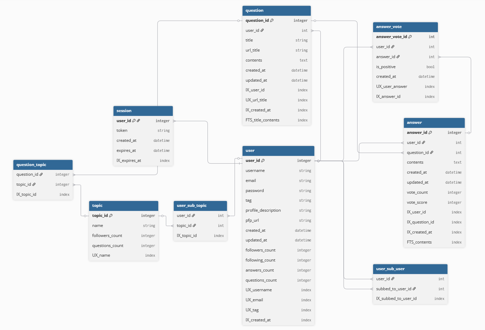

# Курсовая работа по курсу "Проектирование высоконагруженных систем"

Студент: Волощук А. Д.
Группа: WEB-41 (осень 2025)

# Quora

## 1. Тема и целевая аудитория

**Тип сервиса**: вопросно-ответный форум, сфокусированный на формировании качественной базы знаний

**Местоположение целевой аудитории**: мир

**MAU**: 400M ([1](https://www.demandsage.com/quora-statistics/))
**DAU**: 27M ([1](https://www.demandsage.com/quora-statistics/))

**Основные регионы по числу посещений** ([1](https://www.demandsage.com/quora-statistics/)):

| Страна/Регион | Число пользователей |
|---------------|---------------------|
| США | 148M |
| Индия | 100M |
| Европа | 78M |
| Юго-Восточная Азия | 24M |
| Великобритания | 22.5M |
| Средний Восток и Северная Африка | 15M |
| Канада | 20M |
| Австралия и Новая Зеландия | 11M |
| Япония | 6.8M |
| Мексика | 3.5M |
| Бразилия | 2.6M |

**Ключевой функционал** - создание и поиск вопросов/ответов

**Ключевое продуктовое решение** - алгоритм ранжирует ответы по полезности, а не по новизне

**Основной функционал MVP**:
* Авторизация и настройка профиля
* Поиск вопроса/ответа
* Создание вопроса
* Создание ответа на вопрос
* Присоединение к Теме
* Голос за/против ответа
* Подписаться на пользователя

## 2. Расчет нагрузки

### Продуктовые показатели:

| Название | Показатель | Расчет |
|----------|------------|--------|
| MAU | 400M | из ([1](https://www.demandsage.com/quora-statistics/)) |
| DAU | 27M | из ([1](https://www.demandsage.com/quora-statistics/)) |
| Число пользователей | 430M | из ([1](https://www.demandsage.com/quora-statistics/)) |
| Вопросов в день | 28K | экспериментальный расчет: разница qid = 219159070 - 219103067 = 56003; разница времени = 1 день 20 часов 30 минут 21 секунда = 1.854 дня; вопросы/день = 56,003 / 1.854 ≈ 30207; с учетом неравномерности и пиковых нагрузок берем 28000 |
| Ср. ответов на вопрос | 5 | из ([1](https://www.demandsage.com/quora-statistics/)) |
| Время на сайте | 9 мин/день | из ([1](https://www.demandsage.com/quora-statistics/)) |
| Число тем | 300K | из ([1](https://www.demandsage.com/quora-statistics/)) |
| Всего вопросов | 40.9M | 16лет * 365дн/год * 28000/день / 4, где 16 - возраст сервиса, /4 - учет нелинейности роста |
| Всего ответов | 204.5M | 40.9M * 5 |
| Ср. тем на вопрос | 3 | самостоятельное исследование |
| Ср. оценок на ответ | 8 | самостоятельное исследование |
| Ср. подписок на пользователя | 4 | самостоятельное исследование |
| Ср. подписок на тему | 5 | самостоятельное исследование |
| Ср. ответов на вопрос | 0.71 /день | самостоятельное исследование, отношение числа ответов на вопрос к его возрасту в днях за много лет |
| Ср. размер изображения ответа | 86.8 КБ | самостоятельное исследование |
| Ср. размер изображения профиля | 16 КБ | самостоятельное исследование |
| Ср. размер вопроса | 75 Б | самостоятельное исследование: 50 символов * 1.5Б (ср. символ Unicode) |
| Ср. размер текста ответа | 639 Б | самостоятельное исследование: 426 символов * 1.5Б (ср. символ Unicode) |
| Ср. изображений на ответ | 0.85 | самостоятельное исследование: большой коэффициент, т.к. многие ответы содержат несколько изображений |
| Ср. просмотров ответа | 4.35 /день | самостоятельное исследование |
| Шанс оценки ответа при просмотре | 0.05 | самостоятельное исследование |

### RPS/трафик:

| Запрос | RPS | Расчет RPS | Трафик | Расчет трафика |
|--------|-----|------------|--------|----------------|
| Отправка вопросов | 0.32 | 28000/день / 86400с/день | 24.2 Б/с | 75Б * 0.32/с |
| Отправка текста ответов | 168 | положим, что пользователи отвечают только на вопросы не старше 2х лет (их q_2yr = 2года * 365дн/год * 28000/день, возьмем 28000/день как постоянную), тогда RPS ответов q_2yr * 0.71/день / 86400с/день | 280 КБ/с | оценим средний вес HTTP запроса/ответа с куками в 1КБ, тогда трафик (1КБ + 0.639КБ) * 168/с |
| Отправка изображений ответов | 143 | 168/с * 0.85 | 12.4 МБ/с | 86.8КБ * 143/с |
| Просмотр текста ответов | 10,290 | из статистики просмотров ответов (т.к. она за долгое время, можем применить к общему количеству ответов): 204.5M * 4.35/день / 86400с/день | 16.8 МБ/с | (1КБ + 0.639КБ) * 10,290/с |
| Просмотр изображений ответов | 8,747 | 0.85 * 10,290/с | 759 МБ/с | 86.8КБ * 8,747/с |
| Оценка ответов | 515 | 10,290/с * 0.05 | 515 КБ/с | 1КБ * 515/с |
| Поиск | 313 | 27M/день / 86400с/день | 313 КБ/с | 1КБ * 313/с |
| Получение статики | 313 | 27M/день / 86400с/день | 228 МБ/с | передается статики без кеша 7МБ, с кешем - 30КБ, допустим, каждый 10й пользователь без кеша: 313/с * (1/10 * 7МБ + 9/10 * 0.03МБ) |
| Итог | = ~24,500 | | = ~2,450 МБ/с | |

### Объем хранилищ:

| Тип | Объем | Расчет |
|-----|-------|--------|
| Профили пользователей | 7 ТБ | текст профиля 200 символов: (16КБ + 200 * 1.5Б) * 430M |
| Вопросы | 0.5 ГБ | 75Б * 5.84M |
| Текст ответов | 19 ГБ | 639Б * 29.2M |
| Изображения ответов | 2.2 ТБ | 86.8КБ * 29.2M * 0.85 |
| Итог | = ~9.2 ТБ | |

## 3. Глобальная балансировка

### Расположение датацентров

Основано на расположении ДЦ AWS ([2](https://docs.aws.amazon.com/global-infrastructure/latest/regions/aws-regions.html))

| Регион | Расположение ДЦ | Пользователи | Failover ДЦ |
|--------|-----------------|--------------|-------------|
| США | Северная Вирджиния, Огайо, Северная Калифорния | 148M | Торонто, Мехико |
| Индия | Мумбаи, Хайдарабад | 100M | Дубай |
| Европа | Германия (Франкфурт), Великобритания (Лондон), Швеция (Стокгольм) | 78M | Дубай |
| Канада | Торонто | 20M | Северная Вирджиния |
| Юго-Восточная Азия | Сингапур | 24M | Сидней |
| Средний Восток и Северная Африка | ОАЭ (Дубай) | 15M | Мумбаи |
| Австралия и Новая Зеландия | Австралия (Сидней) | 11M | Сингапур |
| Япония | Токио | 6.8M | Сингапур |
| Мексика | Мехико | 3.5M | Сан-Паулу |
| Бразилия | Сан-Паулу | 2.6M | Мехико |

Для балансировки используется GeoDNS, т.к. ДЦ расположены в разных регионах на больших расстояниях.

Используется DNS Failover для переключения на сосведние ДЦ при отказе основных ДЦ зоны.

### Разбиение на поддомены

| Поддомен | Назначение | Характер трафика | RPS |
|----------|------------|------------------|-----|
| `quora.com` | Основной домен. | Минимальный | 313 |
| `api.quora.com` | Операций создания и изменения данных (вопросы, ответы, подписки). | Средний, write-heavy | 115 |
| `search.quora.com` | Поисковый сервис. | Высокий, read-heavy | 313 |
| `content.quora.com` | Операции чтения данных (вопросы, ответы, темы). | Очень высокий, read-heavy | 1470 |
| `images.quora.com` | Хостинг изображений. | Высокий, bandwidth-heavy | 1271 |
| `static.quora.com` | Статические ресурсы. | Высокий, cacheable | 313 |
| `auth.quora.com` | Авторизация и профили. | Средний | 313 |

## 4. Локальная балансировка

**L4 - HAProxy/Nginx:**
- Балансировка TCP/UDP соединений
- Используется для статики и изображений
- Алгоритм: Round Robin с весами по производительности серверов

**L7 - Nginx/Envoy:**
- Балансировка HTTP/HTTPS запросов
- Используется для API, поиска и контента
- Алгоритм: Least Connections с health checks

Оркестрация через Kubernetes, SSL Termination для снижения нагрузки на серверы.

### Серверы по поддоменам на один ДЦ:

Проведем расчет для одного ДЦ США, т.е. 148M / 3 = 49M пользователей => доля общего RPS = 49M / 430M = 0.11

Для остальных ДЦ числа будут пропорциональны их числу пользователей (~RPS).

Умножим RPS из таблицы поддоменов на 0.11 и получим:

| Поддомен | RPS | Серверы | RPS/сервер |
|----------|-----|---------|------------|
| `content.quora.com` | 162 | 10 | 16 |
| `images.quora.com` | 140 | 8 | 18 |
| `search.quora.com` | 35 | 4 | 9 |
| `static.quora.com` | 35 | 4 | 9 |
| `auth.quora.com` | 35 | 4 | 9 |
| `api.quora.com` | 13 | 3 | 4 |

Т.к. используем K8s, серверами у нас будут поды. Скажем, используем AWS инстансы c5.large (2 vCPU, 4GB RAM) для нод кластера. В AWS существует готовое решение EKS для K8s кластеров, но использовать его здесь не будем.

Оценим, что инстанс c5.large как рабочая нода может поддерживать работу 6 подов под максимальной нагрузкой (каждый под около 0.3 vCPU и 600MB RAM). Учтем, что на ноду должен быть один Ingress под, остальных остается 5.

Всего у нас 33 пода => требуется минимум 33 / 5 = 7 рабочих нод. Для надежности используем 10 нод, чтобы выдержать падение 3 из них.

Поды для обеспечения надежности каждого отдельного домена будут распределяться по разным нодам (podAntiAffinity).

Из-за особенности работы etcd ([3](https://thenewstack.io/how-many-nodes-for-your-kubernetes-control-plane/)), использование даже 2 мастер-нод недостаточно надежно. Советуется использовать 3 или 5 мастер-нод. Будем использовать 5.

Ingress поды требуются, т.к. нода K8s может по умолчанию иметь только L4 балансировщик kube-proxy. Но нам необходимо обрабатывать запросы на DNS поддомены и выполнять SSL Termination. Ingress поды будут распределять запросы внутри каждой отдельной рабочей ноды.

Над рабочими нодами будут L4 балансировщики, не обрывающие SSL. Сделаем active/passive (не active/active, т.к. в приоритете надежность, а не скорость) кластер из 3х балансировщиков для обеспечания надежности. Для примера, Nginx Plus и Haproxy Enterprise могут быть настроены как L4 балансировщики в режиме кластера active/passive.

Схема локальной балансировки:

## 5. Логическая схема БД

### Описание таблиц

### Таблица `user`
| Поле | Тип данных | Размер (байт) | Описание |
|------|------------|---------------|----------|
| user_id | INTEGER | 4 | PK |
| username | TEXT | 255 | Unique |
| email | TEXT | 255 | Unique |
| password | TEXT | 255 | Хэш пароля |
| tag | TEXT | 100 | Unique |
| profile_description | TEXT | 2000 | Описание профиля |
| pfp_url | TEXT | 1000 | URL аватара |
| created_at | TIMESTAMP | 8 | |
| updated_at | TIMESTAMP | 8 | |
| **Итого на строку** | | **~3885** | |

**Всего строк:** 430M × **~1.67 TB**

### Таблица `session`
| Поле | Тип данных | Размер (байт) | Описание |
|------|------------|---------------|----------|
| user_id | INTEGER | 4 | PK |
| token | TEXT | 512 | Токен сессии |
| created_at | TIMESTAMP | 8 | |
| expires_at | TIMESTAMP | 8 | |
| **Итого на строку** | | **~532** | |

**Всего строк:** 27M (DAU) × **~14.1 GB**

### Таблица `question`
| Поле | Тип данных | Размер (байт) | Описание |
|------|------------|---------------|----------|
| question_id | INTEGER | 4 | PK |
| user_id | INTEGER | 4 | |
| title | TEXT | 255 | |
| url_title | TEXT | 255 | Unique |
| contents | TEXT | 2000 | |
| created_at | TIMESTAMP | 8 | |
| updated_at | TIMESTAMP | 8 | |
| **Итого на строку** | | **~2534** | |

**Всего строк:** 40.9M × **~103.7 GB**

### Таблица `topic`
| Поле | Тип данных | Размер (байт) | Описание |
|------|------------|---------------|----------|
| topic_id | INTEGER | 4 | PK |
| name | TEXT | 255 | Unique |
| **Итого на строку** | | **~259** | |

**Всего строк:** 300K × **~77.7 MB**

### Таблица `question_topic`
| Поле | Тип данных | Размер (байт) | Описание |
|------|------------|---------------|----------|
| question_id | INTEGER | 4 | |
| topic_id | INTEGER | 4 | |
| **Итого на строку** | | **8** | |

**Всего строк:** 40.9M × 3 (ср. тем на вопрос) × **~981.6 MB**

### Таблица `answer`
| Поле | Тип данных | Размер (байт) | Описание |
|------|------------|---------------|----------|
| answer_id | INTEGER | 4 | PK |
| user_id | INTEGER | 4 | |
| question_id | INTEGER | 4 | |
| contents | TEXT | 2000 | |
| created_at | TIMESTAMP | 8 | |
| updated_at | TIMESTAMP | 8 | |
| **Итого на строку** | | **~2028** | |

**Всего строк:** 204.5M × **~414.7 GB**

### Таблица `answer_vote`
| Поле | Тип данных | Размер (байт) | Описание |
|------|------------|---------------|----------|
| answer_vote_id | INTEGER | 4 | PK |
| user_id | INTEGER | 4 | |
| answer_id | INTEGER | 4 | |
| is_positive | BOOLEAN | 1 | |
| created_at | TIMESTAMP | 8 | |
| **Итого на строку** | | **~21** | |

**Всего строк:** 204.5M × 8 (ср. оценок на ответ) × **~34.4 GB**

### Таблица `user_sub_user`
| Поле | Тип данных | Размер (байт) | Описание |
|------|------------|---------------|----------|
| user_id | INTEGER | 4 | |
| subbed_to_user_id | INTEGER | 4 | |
| **Итого на строку** | | **8** | |

**Всего строк:** 430M × 4 (ср. подписок на пользователя) × **~13.76 GB**

### Таблица `user_sub_topic`
| Поле | Тип данных | Размер (байт) | Описание |
|------|------------|---------------|----------|
| user_id | INTEGER | 4 | |
| topic_id | INTEGER | 4 | |
| **Итого на строку** | | **8** | |

**Всего строк:** 430M × 5 (ср. подписок на тему) × **~17.2 GB**

### Нагрузка (QPS) на чтение/запись

| Таблица | Операции | QPS Запись | QPS Чтение | Всего QPS | Особенности нагрузки |
|---------|----------|------------|------------|-----------|---------------------|
| **user** | Регистрация, профиль | 5 | 625 | 630 | Высокая читаемость профилей |
| **session** | Логин/логаут | 313 | 625 | 938 | Очень высокая частота доступа |
| **question** | Создание вопросов | 0.32 | 10,290 | 10,290.32 | Доминирует чтение |
| **topic** | Создание тем | 0.01 | 313 | 313.01 | В основном чтение |
| **question_topic** | Связи вопрос-тема | 0.95 | 10,290 | 10,290.95 | Высокая читаемость |
| **answer** | Создание ответов | 168 | 10,290 | 10,458 | Баланс чтения/записи |
| **answer_vote** | Голосование | 515 | 1,029 | 1,544 | Частые обновления |
| **user_sub_user** | Подписки | 10 | 625 | 635 | Социальный граф |
| **user_sub_topic** | Подписки на темы | 5 | 625 | 630 | Фиды контента |
| **Итого** | | **~1,303** | **~51,450** | **~52,753** | |

### Требования к консистентности

| Таблица | Уровень консистентности |
|---------|-------------------------|
| **user** | Strong |
| **session** | Eventual |
| **question** | Strong |
| **topic** | Strong |
| **question_topic** | Strong |
| **answer** | Strong |
| **answer_vote** | Eventual |
| **user_sub_user** | Eventual |
| **user_sub_topic** | Eventual |

## 6. Физическая схема БД

### Индексы

| Таблица | Индекс | Тип | Поля | Назначение |
|---------|--------|-----|------|------------|
| **user** | PK | Primary | user_id | Основной ключ |
| **user** | UX_username | Unique | username | Поиск по имени пользователя |
| **user** | UX_email | Unique | email | Авторизация |
| **user** | UX_tag | Unique | tag | Поиск по тегу |
| **user** | IX_created_at | B-tree | created_at | Аналитика новых пользователей |
| **session** | PK | Primary | user_id | Основной ключ |
| **session** | IX_expires_at | B-tree | expires_at | Очистка устаревших сессий |
| **question** | PK | Primary | question_id | Основной ключ |
| **question** | IX_user_id | B-tree | user_id | Поиск вопросов пользователя |
| **question** | UX_url_title | Unique | url_title | SEO-friendly URL |
| **question** | IX_created_at | B-tree | created_at | Сортировка по дате |
| **question** | FTS_title_contents | Full-text | title, contents | Поиск по тексту |
| **topic** | PK | Primary | topic_id | Основной ключ |
| **topic** | UX_name | Unique | name | Поиск по названию темы |
| **question_topic** | PK | Composite | question_id, topic_id | Основной ключ |
| **question_topic** | IX_topic_id | B-tree | topic_id | Поиск вопросов по теме |
| **answer** | PK | Primary | answer_id | Основной ключ |
| **answer** | IX_user_id | B-tree | user_id | Ответы пользователя |
| **answer** | IX_question_id | B-tree | question_id | Ответы на вопрос |
| **answer** | IX_created_at | B-tree | created_at | Сортировка по дате |
| **answer** | FTS_contents | Full-text | contents | Поиск по тексту ответов |
| **answer_vote** | PK | Primary | answer_vote_id | Основной ключ |
| **answer_vote** | UX_user_answer | Unique | user_id, answer_id | Один голос на пользователя |
| **answer_vote** | IX_answer_id | B-tree | answer_id | Подсчет голосов |
| **user_sub_user** | PK | Composite | user_id, subbed_to_user_id | Основной ключ |
| **user_sub_user** | IX_subbed_to_user_id | B-tree | subbed_to_user_id | Подписчики пользователя |
| **user_sub_topic** | PK | Composite | user_id, topic_id | Основной ключ |
| **user_sub_topic** | IX_topic_id | B-tree | topic_id | Подписчики темы |

### Денормализация

| Таблица | Денормализованное поле | Источник | Назначение | Выигрыш |
|---------|------------------------|----------|------------|----------|
| **answer** | vote_count | answer_vote | Количество голосов | Ускорение сортировки ответов |
| **answer** | vote_score | answer_vote | Разница голосов за/против | Ранжирование ответов |
| **user** | followers_count | user_sub_user | Количество подписчиков | Отображение в профиле |
| **user** | following_count | user_sub_user | Количество подписок | Отображение в профиле |
| **user** | answers_count | answer | Количество ответов | Отображение в профиле |
| **user** | questions_count | question | Количество вопросов | Отображение в профиле |
| **topic** | followers_count | user_sub_topic | Количество подписчиков | Популярность тем |
| **topic** | questions_count | question_topic | Количество вопросов | Активность тем |

### Выбор СУБД

| Таблица | СУБД | Обоснование |
|---------|------|-------------|
| **user** | PostgreSQL | Сложные транзакции, строгая консистентность |
| **session** | Redis | Временные данные, высокая скорость доступа |
| **question** | PostgreSQL | Full-text поиск, транзакции |
| **topic** | PostgreSQL | Справочные данные, строгая консистентность |
| **question_topic** | PostgreSQL | Связующие данные, транзакции |
| **answer** | PostgreSQL | Full-text поиск, транзакции |
| **answer_vote** | Cassandra | Высокая частота записи, eventual consistency |
| **user_sub_user** | Neo4j | Графовые запросы, социальные связи |
| **user_sub_topic** | Neo4j | Графовые запросы, рекомендации |

### Шардирование и резервирование СУБД

**Расчет количества шардов:**

Количество шардов рассчитано для одного ДЦ США.

| Таблица | Стратегия шардинга | Ключ шардинга | Количество шардов | Репликация |
|---------|-------------------|---------------|-------------------|------------|
| **user** | Range-based | user_id | 15 | Master-Slave (3 реплики) |
| **session** | Hash-based | user_id | 10 | Redis Cluster (авто-репликация) |
| **question** | Range-based | question_id | 10 | Master-Slave (3 реплики) |
| **topic** | No sharding | - | 1 | Master-Slave (3 реплики) |
| **question_topic** | Composite | question_id | 10 | Master-Slave (3 реплики) |
| **answer** | Range-based | answer_id | 15 | Master-Slave (3 реплики) |
| **answer_vote** | Hash-based | answer_id | 25 | Cassandra (RF=3) |
| **user_sub_user** | Hash-based | user_id | 10 | Neo4j Causal Cluster |
| **user_sub_topic** | Hash-based | user_id | 10 | Neo4j Causal Cluster |

### Клиентские библиотеки / интеграции

| СУБД | Клиентская библиотека (Go) | Особенности использования |
|------|----------------------------|---------------------------|
| **PostgreSQL** | `github.com/jackc/pgx/v5` | Нативный Go драйвер, пул соединений, подготовленные выражения |
| **Redis** | `github.com/redis/go-redis/v9` | Поддержка кластера, пайплайнинг, поддержка контекста |
| **Cassandra** | `github.com/gocql/gocql` | Маршрутизация по токенам, балансировка нагрузки, пакетные операции |
| **Neo4j** | `github.com/neo4j/neo4j-go-driver/v5` | Управление сессиями, поддержка транзакций, пул соединений |

### Балансировка запросов / мультиплексирование подключений

**Архитектура подключения:**
- PgBouncer для PostgreSQL connection pooling
- Redis Cluster для распределения нагрузки
- Cassandra driver с token-aware routing
- Neo4j driver с connection pooling

### Схема резервного копирования

| СУБД | Стратегия | Частота | Хранение |
|------|-----------|---------|----------|
| **PostgreSQL** | WAL + Base backup | Continuous + Daily | S3 (7 дней) |
| **Redis** | RDB + AOF | Hourly + Continuous | S3 (30 дней) |
| **Cassandra** | Snapshot + Incremental | Daily + Continuous | S3 (30 дней) |
| **Neo4j** | Online backup | Daily | S3 (30 дней) |

## Список используемых источников
1. https://www.demandsage.com/quora-statistics/
2. https://docs.aws.amazon.com/global-infrastructure/latest/regions/aws-regions.html
3. https://thenewstack.io/how-many-nodes-for-your-kubernetes-control-plane/
